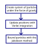

<h1 align="center"> Rope simulation </h1>

<p align="center">
  
  
  
  
</p>
<p align="center"> Simulation of a rope under the effect of gravity </p>

<p align="center">
  
  
</p>

| | |
|---|---|
| **Concepts** | Verlet Integration, Constraints, Real-time Simulation |
| **Context** | Introduction to C++ and Numerical Methods course |
| **Status** | Completed |


## Table of Contents

- [Implementation](#implementation)
- [Folder Structure](#folder-structure)
- [Building Instructions](#building-instructions)
- [Future work](#future-work)
- [References](#references)

## Implementation

<p align="center">
  
</p>

## Folder Structure

```text
Rope_simulation
├── dependencies/          # Third-party libraries (GLFW, GLAD, GLM, KHR)
├── src/
│   ├── physics/           # Rope physics and numerical integration
│   │   ├── constraints_JakobsenMethod.*
│   │   ├── systemDynamics.*
│   │   └── updatePositions_verletIntegration.*
│   │
│   ├── shaders/           # GLSL shader programs
│   │
│   ├── rendering.*        # Rendering pipeline and OpenGL drawing
│   ├── libraries.h        # External library includes
│   ├── glad.c             # OpenGL loader source
│   └── main.cpp           # Application entry point
│
├── CMakeLists.txt         # Build configuration
└── README.md
```

### Description

- **dependencies/** – Contains all third-party libraries required to build the project. No additional downloads are needed.

- **physics/** – Implements the rope simulation using Verlet integration and Jakobsen's constraint relaxation method.

- **shaders/** – GLSL vertex and fragment shaders used for rendering.

- **rendering.cpp / rendering.h** – Handles OpenGL rendering, drawing routines, and visualization.

- **main.cpp** – Initializes the application, creates the simulation, and manages the main loop.

- **CMakeLists.txt** – Defines the build configuration using CMake.

## Future work

## Building Instructions

#### Windows building
All relevant libraries are found in /dependencies. It is necessary to download and configure CMake
(https://cmake.org/download/). Run CMake script and generate project of choice.

#### Linux/WSL building
It is necessary to have CMake, Git and the required packages: Using root (sudo) and type ```apt-get install libsoil-dev
libglm-dev libglew-dev libglfw3-dev```

#### Build through CMake command line:
```
cd /path/to/Rope_simulation
mkdir build && cd build
cmake ..
make
```
## References
1. R. Badea, *[Owlree—Simulating a Rope (Games Series)](https://owlree.blog/posts/simulating-a-rope.html)*. Accessed: Apr. 4, 2024.
